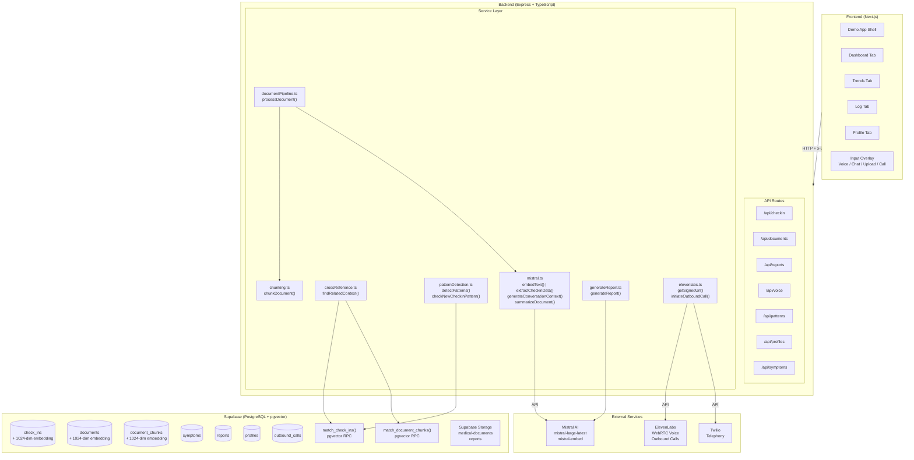
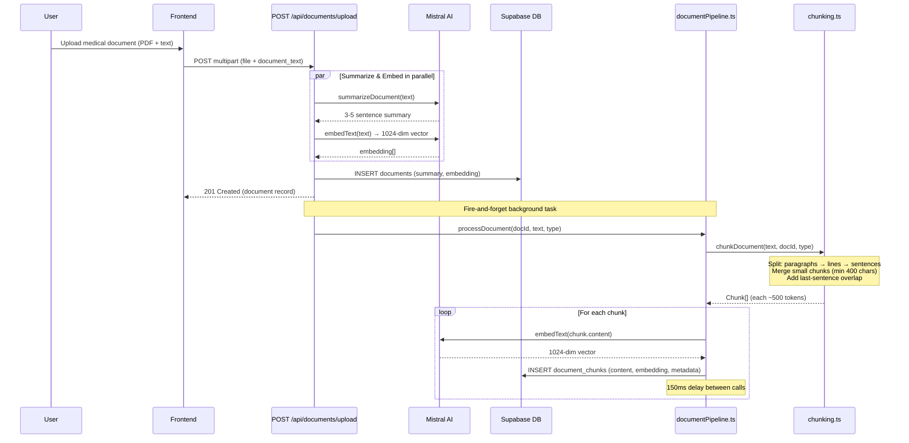
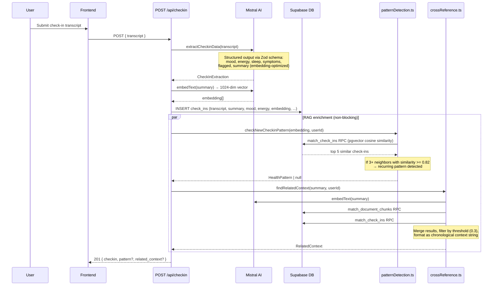
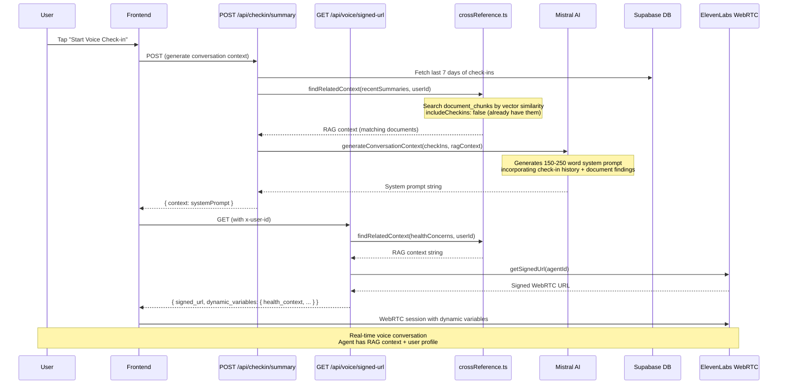
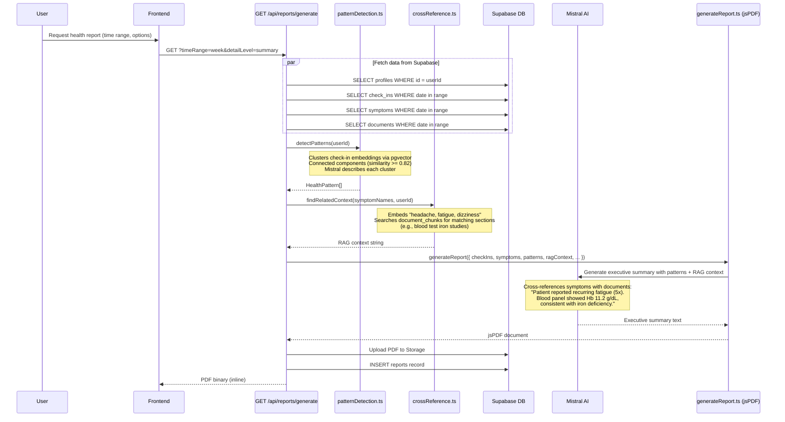
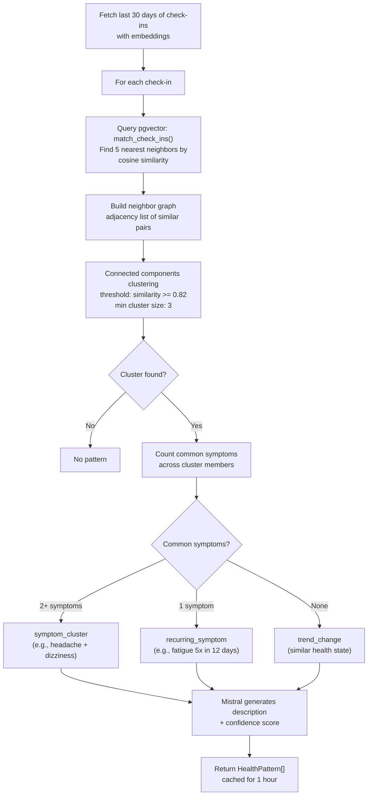
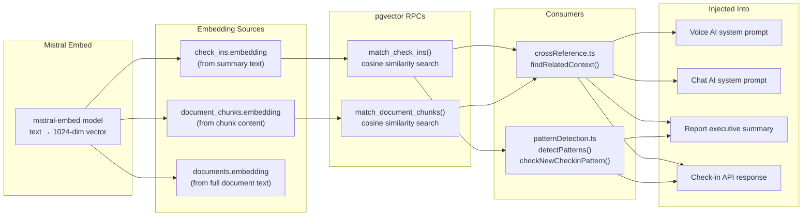

# Backend Architecture — RAG & Data Flows

## High-Level System Overview

## RAG Data Flow — Document Upload & Chunking

## RAG Data Flow — Check-in Creation with Pattern Detection

## RAG Data Flow — Voice Session with Context Injection

## RAG Data Flow — Report Generation with Cross-Referencing

## Pattern Detection Algorithm

## Vector Search Infrastructure

